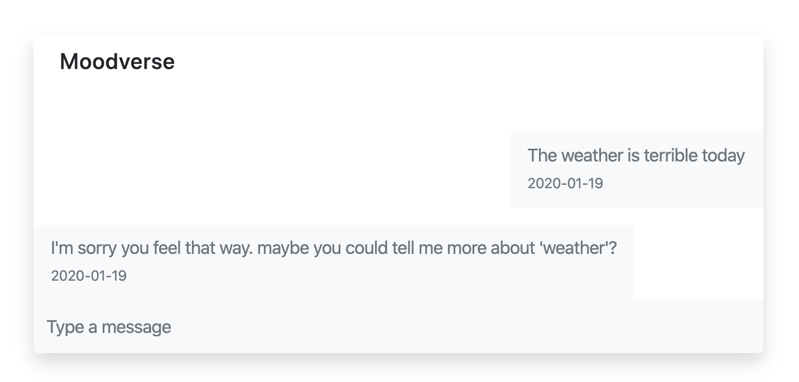

# Moodverse
Mental health advocacy is something our entire team is very passionate about. We wanted to use this opportunity to prototype a solution that addresses the need for quick, short-term self-help services based on the principles of cognitive behavioural therapy. And thus the Moodverse mental wellness chatbot was born!

Moodverse is the next generation chatbot to improve your mood.

## Use Case
Say you're experiencing a low mood and want to talk it out with Moodverse. Moodverse will use natural language processing and your conversation to identify the severity of your low mood and the possible sources of stress or anxiety leading up to it.

Based on that, it will try and get you to identify cognitive distortions, that is, patterns of negative thinking, and talk you through reframing them to help you feel better!

Moodverse also gives you insights over time about your mood and the common negative patterns of thinking you've had in the recent past.

## Requirements installation
`pip install -r requirements.txt`

## Usage
To start the development server, run `server.py`. To start the front end run `npm run start` in the angular project located in Server/front.

## Models
### Sentiment Analysis Model
- Used Google Cloud's NLP API to gain insights about how users feel about certain stressors they talk about.
- Generated a self-love score to know how users were feeling about themselves during a session

### Generative Models
- Used generative models to come up with sympathetic and encouraging statements.

### Cognitive Distortions Model
- Used cosine similarity between sentences with cognitive distortions and new input sentences to detect and classify common cognitive distortions.

## Technology Used
### Backend
- Google Cloud Platform Natural Language Processing, Compute Engine, Firestore
- Python Flask, Socket.io
- Keras
- PyTorch
- LTSM Models
- RNN Models
- Text Generation

### Frontend
- Angular

## What's Next
- Gaining more input from healthcare specialists
- Integrating voice-to-text features
- Integration with smart home devices
